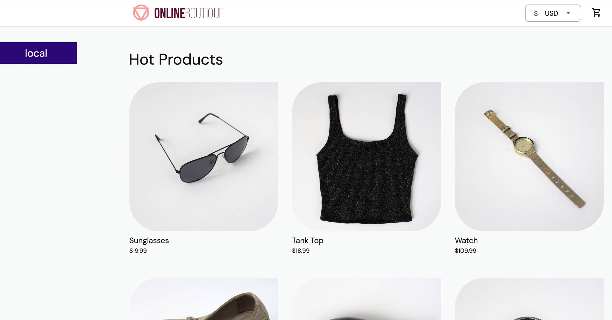
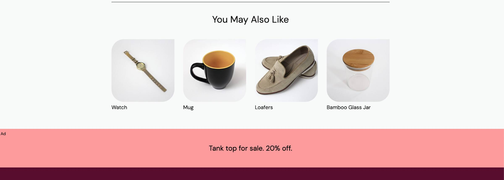
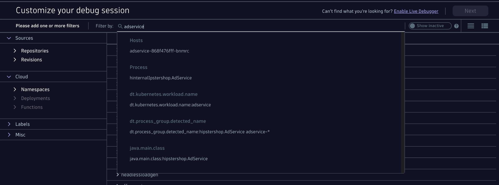
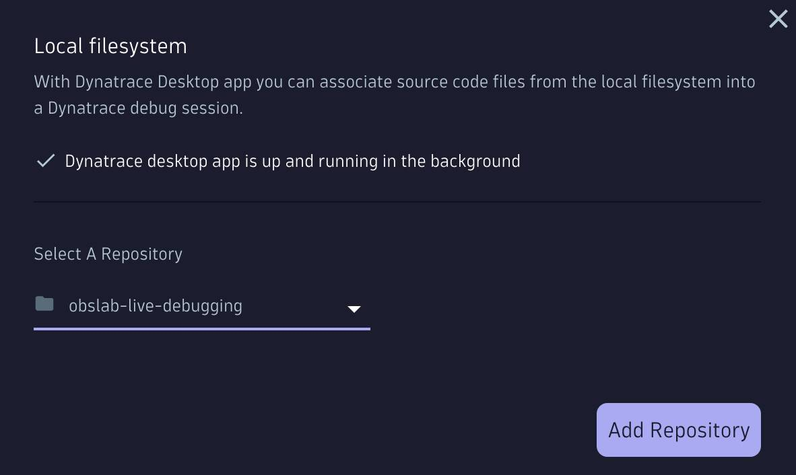
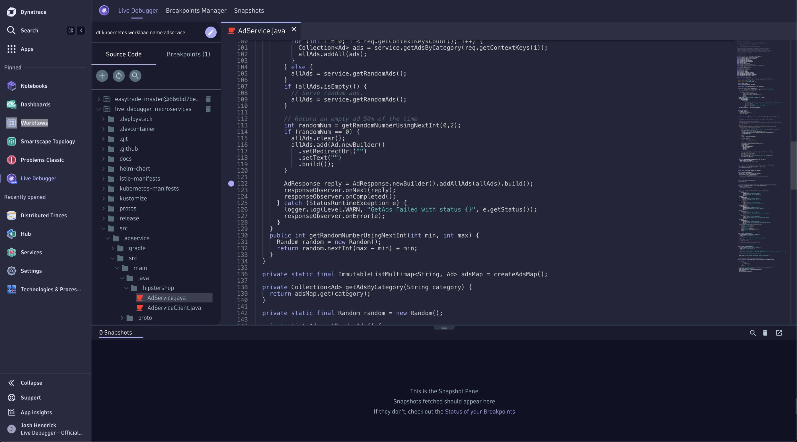
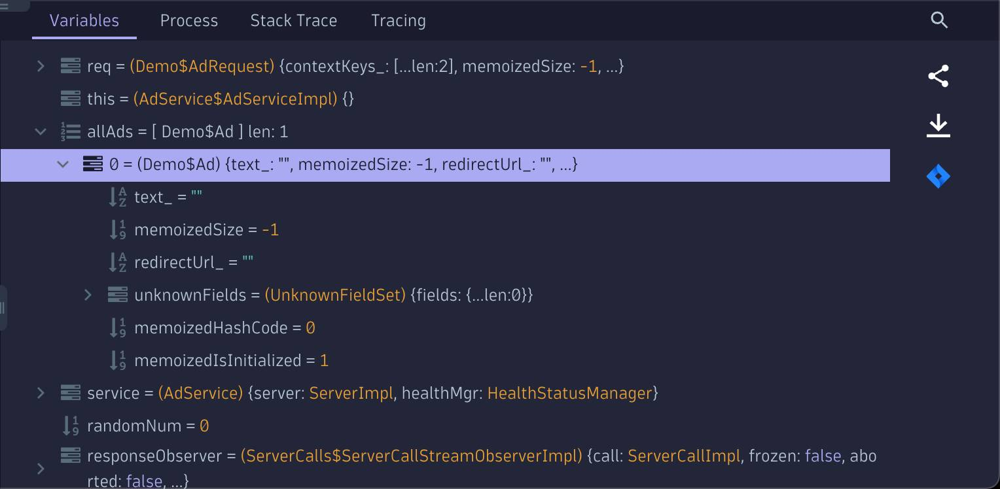
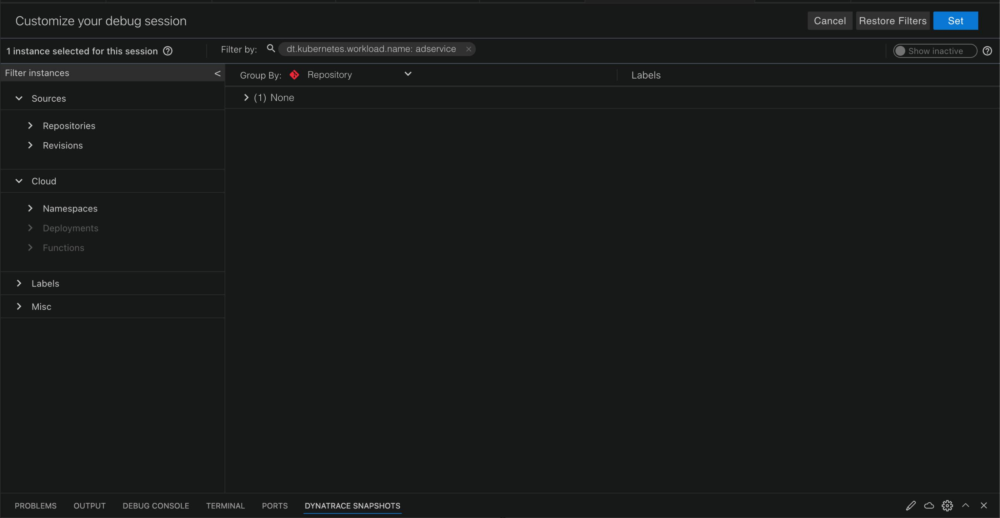
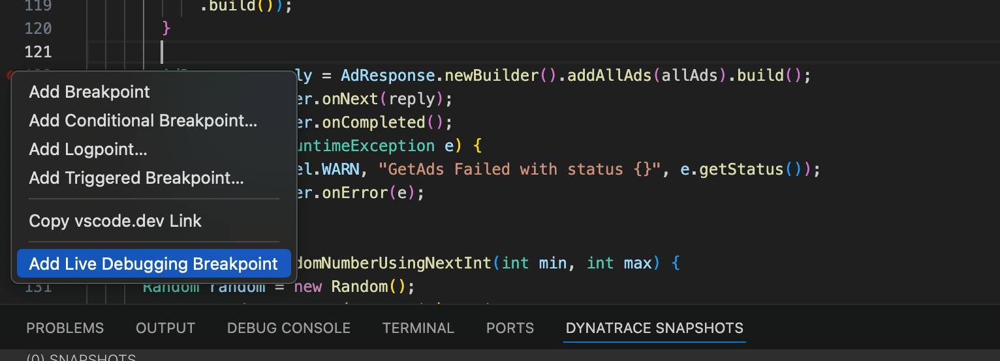

# Dynatrace Live Debugger End to End Demo Environment

The Demo environment will showcase the following:

- Setup of the **Dynatrace OneAgent** within a local Kuberentes cluster
- Debugging an application issue with **Dynatrace Live Debugger**
- Fixing a bug, rebuilding and deploying the fix to the cluster using Skaffold
- Validating the fix directly within a local VSCode IDE using the **Dynatrace Code Monitoring** extension

## Architecture

This demo uses the **Online Boutique** which is composed of 11 microservices written in different
languages that talk to each other over gRPC. It's setup to run inside a Kind Kubernetes cluster


| Service                                              | Language      | Description                                                                                                                       |
| ---------------------------------------------------- | ------------- | --------------------------------------------------------------------------------------------------------------------------------- |
| [frontend](/src/frontend)                           | Go            | Exposes an HTTP server to serve the website. Does not require signup/login and generates session IDs for all users automatically. |
| [cartservice](/src/cartservice)                     | C#            | Stores the items in the user's shopping cart in Redis and retrieves it.                                                           |
| [productcatalogservice](/src/productcatalogservice) | Go            | Provides the list of products from a JSON file and ability to search products and get individual products.                        |
| [currencyservice](/src/currencyservice)             | Node.js       | Converts one money amount to another currency. Uses real values fetched from European Central Bank. It's the highest QPS service. |
| [paymentservice](/src/paymentservice)               | Node.js       | Charges the given credit card info (mock) with the given amount and returns a transaction ID.                                     |
| [shippingservice](/src/shippingservice)             | Go            | Gives shipping cost estimates based on the shopping cart. Ships items to the given address (mock)                                 |
| [emailservice](/src/emailservice)                   | Python        | Sends users an order confirmation email (mock).                                                                                   |
| [checkoutservice](/src/checkoutservice)             | Go            | Retrieves user cart, prepares order and orchestrates the payment, shipping and the email notification.                            |
| [recommendationservice](/src/recommendationservice) | Python        | Recommends other products based on what's given in the cart.                                                                      |
| [adservice](/src/adservice)                         | Java          | Provides text ads based on given context words.                                                                                   |
| [loadgenerator](/src/loadgenerator)                 | Python/Locust | Continuously sends requests imitating realistic user shopping flows to the frontend.                                              |


## Quickstart

1. Start a codespaces workspace by going to Codespaces and then selecting 'New with options' or by [clicking here](https://github.com/codespaces/new?hide_repo_select=true&ref=main&repo=846712282&skip_quickstart=true). You will need your Dynatrace tenant endpoint which should look something like 'https://abc12345.live.dynatrace.com' as well as a Dynatrace Operator Token.

2. The codespace will automatically create a [Kind](https://kind.sigs.k8s.io/) Kubernetes cluster and deploy the microservices application. Once the codespaces is started the following services should be running in the Kind cluster:

   ```sh
   kubectl get pods
   ```

   After a few minutes, you should see the Pods in a `Running` state:

   ```
   NAME                                     READY   STATUS    RESTARTS   AGE
   adservice-76bdd69666-ckc5j               1/1     Running   0          2m58s
   cartservice-66d497c6b7-dp5jr             1/1     Running   0          2m59s
   checkoutservice-666c784bd6-4jd22         1/1     Running   0          3m1s
   currencyservice-5d5d496984-4jmd7         1/1     Running   0          2m59s
   emailservice-667457d9d6-75jcq            1/1     Running   0          3m2s
   frontend-6b8d69b9fb-wjqdg                1/1     Running   0          3m1s
   loadgenerator-665b5cd444-gwqdq           1/1     Running   0          3m
   paymentservice-68596d6dd6-bf6bv          1/1     Running   0          3m
   productcatalogservice-557d474574-888kr   1/1     Running   0          3m
   recommendationservice-69c56b74d4-7z8r5   1/1     Running   0          3m1s
   redis-cart-5f59546cdd-5jnqf              1/1     Running   0          2m58s
   shippingservice-6ccc89f8fd-v686r         1/1     Running   0          2m58s
   ```

3. The [Dynatrace OneAgent](https://docs.dynatrace.com/docs/setup-and-configuration/setup-on-k8s) will also be deployed in the cluster using the Dynatrace Operator. You can validate the Operator is running by using the following command:

  ```sh
  kubectl get dynakubes -n dynatrace
  ```

It should be in a `Running` state:

  ```
  NAME       APIURL                                    STATUS       AGE
  kind-k8s   https://abc123.live.dynatrace.com/api     Running      98s
  ```

4. By spinning up the Codespaces, you will have a VSCode environment where you will be able to make code changes to fix an application bug, redeploy the changes to the cluster, and then set Live Debugging breakpoints to validate the change.

5. Next, forward traffic from the service to your local machine using:

```sh
nohup kubectl port-forward deployment/frontend 8080:8080 &
```

6. Click the popup that appears to open the application in a new tab, or navigate to the "Ports" tab from the terminal and copy the URL from the row with port 8080.



7. The application contains a bug where product ads are disappearing 25% of the time. We'll take a look at how we can capture live data using the Live Debugger and also make a fix, then validate the results directly in the VSCode IDE.

8. Navigate to a Product page where you'll see an Ad section. Refresh the page a few times and you'll see in some cases the ad is disappearing. Let's set some non-breaking breakpoints to validate what data we're actually getting back within the code.



9. Navigate to the Live Debugger app within the Dynatrace tenant and click the 'Debug Configuration' button to select the service we want to debug. In the 'Filter by:' text box, type in 'AdService' and select one of the labels for the Ad Service, for example 'dt.kubernetes.workload.name: adservice' and click next.



10. Next you'll need to click the "+" button and select the 'Local Filesystem' option to download the Dynatrace Desktop App. Install the desktop app and start it up. Note that you'll also need to clone this repository so that you have the code locally on your system. Once done, navigate to the repository on your local system and choose 'Done' to be taken into the debugger.



11. Navigate to the AdService.java file by navigating the file system or by using the search button (Cmd/Ctrl+Shift+F)

12. Set a breakpoint on Line 122 by clicking to the left of the line number in the gutter. Go back to your application on the product page and refresh a few times until you see one of the ads disappear and then stop.



13. Navigate back to the Live Debugger and view the collected snapshots. You should see the most recent captured snapshot data contains a variable called 'allAds' which contains a single ad with empty data for the 'text_' and 'redirectUrl_' fields. This is likely the root of the problem, it's expecting to receive valid data, but the ad data is empty.



14. We'll now go back to our Codespaces VSCode IDE to fix the issue, redeploy the AdService and then validate the issue by collecting data directly in the IDE.

15. Let's fix the issue. Open up the 'src/adservice/src/main/java/hipstershop/AdService.java' file. Comment out lines 113-120 which is causing the AdService to return an empty ad.

```
int randomNum = getRandomNumberUsingNextInt(0,2);
        if (randomNum == 0) {
          allAds.clear();
          allAds.add(Ad.newBuilder()
            .setRedirectUrl("")
            .setText("")
            .build());
        }
```

16. Now we'll need to rebuild and redeploy the app to our Kuberentes cluster. Go to the terminal and run the following command which will rebuild and redeploy just the AdService using Skaffold:

```sh
skaffold run -f=skaffold-adservice.yaml
```

17. This should build the image from the Dockerfile and deploy the new container out to the Kind Kuberentes cluster. Wait for the new pod to be up and running.

18. We can now collect additional snapshots to validate that we no longer receive Ad's with empty text data. This time, let's do it with the VSCode IDE extension. Authentication from the codespaces VSCode extension isn't supported, so you'll need to make sure you have a copy of the code cloned locally and a local installation of [VSCode](https://code.visualstudio.com/).

19. Within VSCode, navigate to Code > Settings > Extensions. Search for Dynatrace and install the [Code Monitoring](https://marketplace.visualstudio.com/items?itemName=dynatrace.dynatrace-debugging-extension) extension. You should see the Dynatrace logo in the left hand VSCode menu once it's installed. Click on the Dynatrace logo and then 'Open Dynatrace Snapshots pane'. This will open a terminal window and bring you to the 'Dynatrace Snapshots' tab where you can login to your tenant.

20. Click on 'Log In'. A browser should open where you can authenticate. After logging in, you can open your locally cloned repository by going to File > Open and browsing to the live debugging microservices project you cloned. Let's open the AdService.java file under 'src/adservice/main/java/hipstershop/AdService.java.

21. Before settings a breakpoint, we need to make sure to choose the correct Environment and Filters to use within the extension. In the top right corner of the Dynatrace Snapshots terminal window you'll see a cloud icon. Click on it and set the same tenant environment you've been using for the exercises so far. Next click on the pencil icon and set the same filter that you used previously, for example, 'dt.kubernetes.workload.name: adservice'.



22. Finally we're ready to set a breakpoint. You will have a new type of breakpoint available that can be set after installing the Code Monitoring extension. In AdService.java right click to the left of line 122 and select 'Add Live Debugging Breakpoint'.




23. Now go back to your shop application on the product page and refresh a few times until you see snapshots appear in your IDE. Validate that the bug was fixed and you no longer see ads with empty text.


